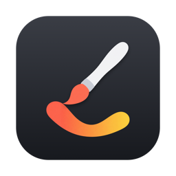
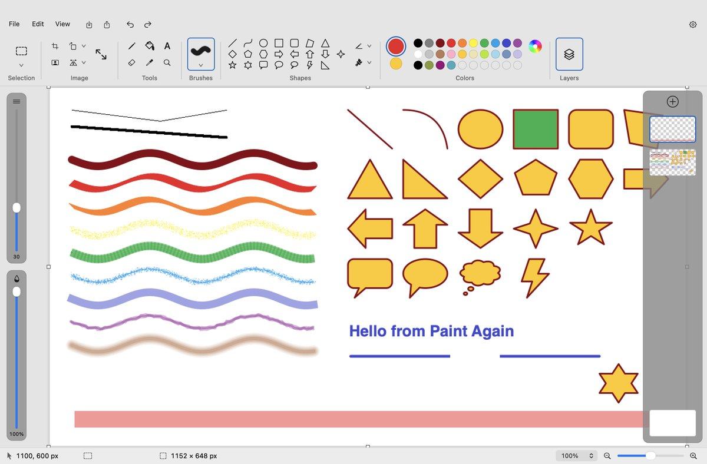

<p align="center">
  
</p>

<h1 align="center">Paint Again</h1>

<p align="center">
  A simple, native drawing app for the Mac — the tools you already know.<br>
  Open source · Fully on-device
</p>

<p align="center">
  <a href="https://apps.apple.com/app/id6809540185">Mac App Store</a> ·
  <a href="https://github.com/HaoCherHong/paint-again/releases/latest">Download</a> ·
  <a href="https://paintagain.app">Website</a> ·
  <a href="CONTRIBUTING.md">Contributing</a> ·
  <a href="https://github.com/HaoCherHong/paint-again/issues">Issues</a>
</p>

<p align="center">
  <a href="https://github.com/HaoCherHong/paint-again/actions/workflows/ci.yml"></a>
  <a href="LICENSE"></a>
  
</p>

<picture>
  <source media="(prefers-color-scheme: dark)" srcset=".github/assets/screenshot-dark.jpg">
  
</picture>

Paint Again re-creates the familiar Paint layout — ribbon, brushes, shapes,
two colors on the left and right mouse buttons — as a native AppKit app, and
adds the things a Mac user expects: layers, Photoshop-style shortcuts, dark
mode, trackpad zoom and Liquid Glass on macOS 26.

## Features

- **Tools**: rectangle and free-form selection, pencil, fill, text, eraser, color picker, magnifier
- **Nine brushes** (brush, calligraphy, airbrush, oil, crayon, marker, natural pencil, watercolor) with a live footprint outline
- **22 shapes** that stay editable — move, resize, bend — until you commit them
- **Layers** over a solid background: reorder by dragging, hide, duplicate, merge, per-layer opacity
- **Image**: crop, resize and skew, rotate, flip, and on-device **Remove background** (Vision)
- **Colors**: Color 1 / Color 2, palette, Edit colors sheet with persistent custom slots
- **Rulers and guides**, gridlines, zoom from 12.5 % to 800 %
- **Keyboard**: Space-drag to pan, `[` `]` for brush size, `1`–`0` for opacity, `B` `E` `G` `T` … for tools
- **Files**: opens PNG, JPEG, BMP, GIF, TIFF, HEIC; saves PNG, JPEG, BMP, GIF, TIFF; print, share, set as desktop picture
- **English and Traditional Chinese** UI
- **Private by design**: no account, no analytics, no network connections

## Install

Requires macOS 14 Sonoma or later, Apple silicon or Intel. Three ways, same app:

| | Price | Updates |
| --- | --- | --- |
| [**Mac App Store**](https://apps.apple.com/app/id6809540185) | US$2.99, one-time — buying it is how you support development | automatic |
| [**GitHub Releases**](https://github.com/HaoCherHong/paint-again/releases/latest) | free | download each new release |
| [**Build from source**](#build-from-source) | free | `git pull` and rebuild |

The GitHub download is `PaintAgain-<version>.zip`, signed with the
maintainer's Developer ID and notarised by Apple. Unzip it, move
`Paint Again.app` to Applications and open it. A `.sha256` file next to each
zip lets you check the download:

```bash
shasum -a 256 -c PaintAgain-<version>.zip.sha256
```

## Build from source

You need Xcode 26 (for the macOS 26 SDK; the app still runs on macOS 14).
There is no Xcode project — it is a plain Swift package.

```bash
git clone https://github.com/HaoCherHong/paint-again.git
cd paint-again/app
scripts/build.sh            # → build/Paint Again.app (ad-hoc signed)
open "build/Paint Again.app"
```

`scripts/build.sh debug` gives a debug build. `swift run` also works for a
quick try, but only `scripts/build.sh` produces a proper `.app` bundle with
the icon and resources in place.

The headless self-test drives every tool on a fresh document and writes a
screenshot, which is the main regression check:

```bash
PAINT_SELFTEST=1 PAINT_SNAPSHOT=/tmp/paint.png PAINT_QUIT=1 PAINT_SNAPSHOT_DELAY=6 \
  "build/Paint Again.app/Contents/MacOS/Paint"
```

More in [CONTRIBUTING.md](CONTRIBUTING.md).

### Building safely

Building from source means you run code on your Mac with your own
permissions, so it is worth a few minutes of care:

1. **Clone only from the official repository**,
   `github.com/HaoCherHong/paint-again`. Forks and mirrors may be fine, but
   you are then trusting whoever runs them.
2. **Build a release tag rather than a random branch tip.** Tags mark the
   code that shipped to the App Store:

   ```bash
   git fetch --tags
   git tag --sort=-v:refname   # newest first
   git checkout v1.0.0
   ```

3. **Check the commit is signed.** Commits on `main` are signed by the
   maintainer and show a green *Verified* badge on GitHub. Locally,
   `git log --show-signature -1` shows the signature when your Git is set up
   to verify SSH signatures.
4. **Read the build script before running it.** `app/scripts/build.sh` is
   about 30 lines: it runs `swift build`, copies the binary and resources into
   an `.app` bundle and signs it ad hoc. The package has **no third-party
   dependencies** (see `app/Package.swift`), so the build downloads nothing.
5. **Never use `sudo`** — nothing in the build needs it. Do not turn off
   Gatekeeper or System Integrity Protection either; a locally built app is
   not quarantined, so macOS opens it without any of that.
6. **Optionally run it inside the App Sandbox**, the same sandbox the App
   Store build uses. It can then only touch files you pick in the Open / Save
   panels:

   ```bash
   scripts/sign-sandboxed.sh   # also prints the entitlements it granted
   ```

7. **Don't run prebuilt binaries from unofficial sources.** The only official
   binaries are the Mac App Store app and the zips on this repo's
   [Releases](https://github.com/HaoCherHong/paint-again/releases) page. A
   release build is signed by the maintainer — check it with
   `codesign -dv --verbose=2 "/Applications/Paint Again.app"` (look for
   `Authority=Developer ID Application: Hao-Jhe Hong`) and
   `spctl -a -vv "/Applications/Paint Again.app"` (`source=Notarized Developer ID`).
   An ad-hoc-signed `.app` someone sends you could contain anything.

The app makes no network connections and has no network entitlement. If you
want to confirm that, `Paint.entitlements` lists everything the sandboxed
build is allowed to do, and a tool such as Little Snitch or LuLu will show
that it never connects out.

## Repository layout

```
app/   macOS app — Swift, AppKit, SwiftPM (no storyboards, no SwiftUI)
web/   paintagain.app — Astro static site (landing page, privacy policy, terms)
```

## Contributing

Bug reports, ideas and pull requests are welcome. Start with
[CONTRIBUTING.md](CONTRIBUTING.md): it covers the build, the code layout,
conventions and how changes are verified. Please follow the
[Code of Conduct](CODE_OF_CONDUCT.md). Security issues go through
[SECURITY.md](SECURITY.md), not public issues.

## License

The source code is released under the [MIT License](LICENSE).

The name **Paint Again** and the app icon identify the official build on the
Mac App Store. Forks are welcome, but please give yours a different name and
icon so users can tell them apart.
